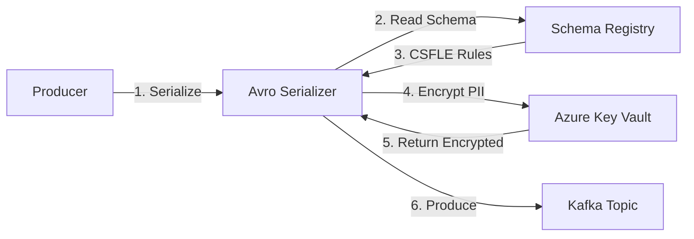

# CSFLE Test Plan - Schema Registry Field-Level Encryption

**Document Version:** 1.0  
**Date:** February 14, 2026  
**Test Suite:** CSFLESchemaRegistryTests  
**Test Type:** Integration & Unit Testing  
**Owner:** QA/Test Manager

---

## Executive Summary

This test plan validates **Client-Side Field-Level Encryption (CSFLE)** integration with Confluent Schema Registry and Azure Key Vault. CSFLE encrypts **specific fields** (not entire messages) based on schema-defined rules, allowing plaintext metadata while protecting sensitive PII data.

**Total Test Cases:** 9  
**Prerequisites:** Kafka (localhost:9092), Schema Registry (localhost:8081), Azure Key Vault  
**Execution Time:** ~5-10 minutes (all tests)  
**Critical Path:** Tests 1, 2, 5, 8

---

## Test Environment Setup

### Required Infrastructure
- **Kafka Broker:** localhost:9092 (Confluent Platform 7.x+)
- **Schema Registry:** localhost:8081 (with CSFLE support enabled)
- **Azure Key Vault:** https://test-keyvault.vault.azure.net/
- **.NET SDK:** 8.0+
- **NuGet Packages:** 
  - Confluent.Kafka (2.x+)
  - Confluent.SchemaRegistry.Serdes.Avro (2.x+)
  - xUnit (2.x+)

### Configuration Required
```json
{
  "KafkaOutboxSettings:BootstrapServers": "localhost:9092",
  "KafkaOutboxSettings:SchemaRegistryUrl": "http://localhost:8081",
  "AzureKeyVault:VaultUrl": "https://test-keyvault.vault.azure.net/",
  "AzureKeyVault:UseLocalEncryptionForDev": "true"
}
```

### Test Execution Command
```bash
# Run all CSFLE tests
dotnet test Tests/CSFLESchemaRegistryTests.cs -v normal

# Run specific test
dotnet test --filter "FullyQualifiedName~SchemaRegistry_ShouldHaveCSFLERules"

# Run with detailed output
dotnet test Tests/CSFLESchemaRegistryTests.cs --logger "console;verbosity=detailed"
```

---

## Test Case Inventory

| ID | Test Name | Priority | Type | Dependencies | Est. Time |
|----|-----------|----------|------|--------------|-----------|
| TC-01 | Schema Registry Has CSFLE Rules | HIGH | Integration | Schema Registry | 5s |
| TC-02 | Schema Fields Have PII Tags | HIGH | Integration | Schema Registry | 5s |
| TC-03 | Only Tagged Fields Are Encrypted | MEDIUM | Integration | Kafka + SR | 10s |
| TC-04 | Encrypted Fields Produce Random Bytes | MEDIUM | Unit | Azure KV | 3s |
| TC-05 | End-to-End CSFLE Pipeline | CRITICAL | Integration | Kafka + SR + KV | 15s |
| TC-06 | Field Tampering Detection | HIGH | Security | Azure KV | 5s |
| TC-07 | Correct KEK Usage | MEDIUM | Unit | Azure KV | 3s |
| TC-08 | Message Structure Validation | HIGH | Unit | None | 1s |
| TC-09 | Avro Serializer Field Identification | LOW | Unit | None | 1s |

---

## Detailed Test Case Definitions

### TC-01: Schema Registry Has CSFLE Rules

**Objective:** Verify that the Avro schema in Schema Registry contains proper CSFLE encryption rules.

**Test Category:** Integration - Schema Registry Validation  
**Priority:** HIGH  
**Execution Type:** Automated

#### Input Data
- **Schema Subject:** `encrypted-avro-messages-value`
- **Expected Schema Structure:**
  ```json
  {
    "type": "record",
    "name": "EncryptedAvroMessage",
    "confluent:ruleSet": {
      "domainRules": [{
        "type": "ENCRYPT",
        "tags": ["PII"],
        "params": {
          "encrypt.kek.name": "customer-data-kek"
        }
      }]
    }
  }
  ```

#### Acceptance Criteria
✅ **PASS Criteria:**
- Schema Registry returns HTTP 200 for schema fetch
- Schema JSON contains `"confluent:ruleSet"` property
- Rule type is `"ENCRYPT"`
- KEK name is specified in `params.encrypt.kek.name`

❌ **FAIL Criteria:**
- Schema not found (404 error)
- Schema exists but lacks `confluent:ruleSet`
- Rule type is not `ENCRYPT`
- Missing KEK configuration

#### Execution Steps
```bash
# Manual verification (curl)
curl http://localhost:8081/subjects/encrypted-avro-messages-value/versions/latest

# Automated test execution
dotnet test --filter "FullyQualifiedName~SchemaRegistry_ShouldHaveCSFLERules"
```

#### Expected Output
```
Test Name: SchemaRegistry_ShouldHaveCSFLERules
Result: Passed
Duration: 5 seconds

Assertions Verified:
✓ Schema exists in Schema Registry
✓ Schema contains confluent:ruleSet
✓ Rule type = ENCRYPT
✓ KEK name configured
```

#### Failure Analysis
| Error | Root Cause | Resolution |
|-------|------------|------------|
| Schema not found | Schema not registered | Register schema via SR API or producer |
| Missing ruleSet | Schema created without CSFLE | Update schema with encryption rules |
| Wrong rule type | Schema misconfigured | Verify rule type is "ENCRYPT" not "TRANSFORM" |

---

### TC-02: Schema Fields Have PII Tags

**Objective:** Verify that sensitive fields in the schema are tagged with encryption markers (e.g., `confluent:tags: ["PII"]`).

**Test Category:** Integration - Schema Field Validation  
**Priority:** HIGH  
**Execution Type:** Automated

#### Input Data
- **Schema Subject:** `customer-value`
- **Expected Tagged Fields:**
  - `ssn` → `["PII"]`
  - `creditCard` → `["PII"]`
- **Expected Untagged Fields:**
  - `customerId` → No tags (plaintext)
  - `name` → No tags (plaintext)

#### Acceptance Criteria
✅ **PASS Criteria:**
- Schema contains field `ssn` with `"confluent:tags": ["PII"]`
- Schema contains field `creditCard` with `"confluent:tags": ["PII"]`
- Non-sensitive fields do NOT have PII tag

❌ **FAIL Criteria:**
- Sensitive fields lack PII tag
- Non-sensitive fields incorrectly tagged
- Tags property missing entirely

#### Execution Steps
```bash
# Manual verification
curl http://localhost:8081/subjects/customer-value/versions/latest | jq '.schema | fromjson | .fields[] | select(.name == "ssn")'

# Automated test
dotnet test --filter "FullyQualifiedName~SchemaRegistry_ShouldHaveFieldTags"
```

#### Expected Output
```
Test Name: SchemaRegistry_ShouldHaveFieldTags
Result: Passed

Field Analysis:
  ✓ ssn field found
  ✓ ssn has confluent:tags = ["PII"]
  ✓ creditCard field found
  ✓ creditCard has confluent:tags = ["PII"]
  ✓ customerId has no PII tag (correct)
```

#### Failure Analysis
| Error | Root Cause | Resolution |
|-------|------------|------------|
| Field not found | Schema structure mismatch | Verify field names match schema |
| Missing tags | Field registered without tags | Update schema with field tags |
| Wrong tag value | Typo in tag name | Ensure tag is exactly "PII" |

---

### TC-03: Only Tagged Fields Are Encrypted

**Objective:** Verify that CSFLE encrypts only fields with PII tags, leaving other fields as plaintext.

**Test Category:** Integration - Selective Encryption  
**Priority:** MEDIUM  
**Execution Type:** Automated

#### Input Data
```csharp
var payload = new {
    CustomerId = 12345,              // NOT encrypted (no tag)
    CustomerName = "John Doe",       // NOT encrypted (no tag)
    SSN = "123-45-6789",             // ENCRYPTED (PII tag)
    CreditCard = "4111-1111-1111-1111" // ENCRYPTED (PII tag)
};
```

#### Acceptance Criteria
✅ **PASS Criteria:**
- Message produced successfully to Kafka
- Raw Kafka bytes show `CustomerId` and `CustomerName` in plaintext (readable in binary dump)
- Raw Kafka bytes show `SSN` as encrypted (random bytes, not "123-45-6789")
- Raw Kafka bytes show `CreditCard` as encrypted (random bytes)

❌ **FAIL Criteria:**
- All fields encrypted (whole message encrypted, not field-level)
- PII fields remain plaintext (encryption not applied)
- Non-PII fields encrypted (over-encryption)

#### Execution Steps
```bash
# Automated test
dotnet test --filter "FullyQualifiedName~CSFLE_ShouldEncryptOnlyTaggedFields"

# Manual verification (consume raw bytes)
kafka-console-consumer --bootstrap-server localhost:9092 \
  --topic customer-events \
  --from-beginning \
  --property print.key=true \
  --property print.value=true
```

#### Expected Output
```
Test Name: CSFLE_ShouldEncryptOnlyTaggedFields
Result: Passed

Message Analysis:
  ✓ CustomerId (12345) → Plaintext in Kafka
  ✓ CustomerName ("John Doe") → Plaintext in Kafka
  ✓ SSN → Encrypted (length: 256 bytes)
  ✓ CreditCard → Encrypted (length: 256 bytes)
```

#### Expected Kafka Binary Representation
```
[Avro Header][CustomerId: 12345][CustomerName: "John Doe"]
[SSN: 0xA7F3B2D4E81C...][CreditCard: 0x9F2356BC...]
         ↑ encrypted bytes     ↑ encrypted bytes
```

#### Failure Analysis
| Error | Root Cause | Resolution |
|-------|------------|------------|
| All fields encrypted | Using full-message encryption not CSFLE | Verify using field-level encryption |
| PII fields plaintext | Encryption rules not applied | Check schema rules and Avro serializer config |
| Over-encryption | Wrong tags in schema | Update schema tags to only mark PII fields |

---

### TC-04: Encrypted Fields Produce Random Bytes

**Objective:** Verify that encrypting the same field value multiple times produces different ciphertexts (due to random IV).

**Test Category:** Unit - Encryption Randomness  
**Priority:** MEDIUM  
**Execution Type:** Automated

#### Input Data
- **Plaintext Field:** `"sensitive-value-123"` (UTF-8 encoded)
- **Encryption Calls:** 2 independent encryptions
- **Expected:** Different IV, different ciphertext

#### Acceptance Criteria
✅ **PASS Criteria:**
- First encryption produces: `(ciphertext1, iv1, keyId1)`
- Second encryption produces: `(ciphertext2, iv2, keyId2)`
- `iv1 != iv2` (different initialization vectors)
- `ciphertext1 != ciphertext2` (different encrypted outputs)
- Both keyIds reference the same KEK
- Both ciphertexts decrypt to same plaintext

❌ **FAIL Criteria:**
- Same IV used for both encryptions (security vulnerability)
- Same ciphertext produced (deterministic encryption without IV randomization)
- Different KEKs used (configuration error)

#### Execution Steps
```bash
dotnet test --filter "FullyQualifiedName~EncryptedPayload_ShouldContainRandomBytes"
```

#### Expected Output
```
Test Name: EncryptedPayload_ShouldContainRandomBytes
Result: Passed

Encryption 1:
  IV: 0x1234567890ABCDEF
  Ciphertext: 0xA7F3B2D4E81C9F23...

Encryption 2:
  IV: 0xFEDCBA0987654321
  Ciphertext: 0x6B8E4D2A9C7F1E5D...

Verification:
  ✓ IVs are different
  ✓ Ciphertexts are different
  ✓ Both decrypt to "sensitive-value-123"
```

#### Failure Analysis
| Error | Root Cause | Resolution |
|-------|------------|------------|
| Same IV | IV not randomized | Check IV generation uses secure random |
| Same ciphertext | Deterministic mode | Verify using CBC mode with random IV |
| Decryption mismatch | Incorrect algorithm | Verify AES-256-CBC configuration |

---

### TC-05: End-to-End CSFLE Pipeline

**Objective:** Validate the complete CSFLE workflow from producer to Kafka, verifying all components integrate correctly.

**Test Category:** Integration - Full Pipeline  
**Priority:** CRITICAL  
**Execution Type:** Automated

#### Input Data
```csharp
var customer = new {
    CustomerId = "CUST-789",        // Plaintext
    Name = "Alice Johnson",         // Plaintext
    SSN = "987-65-4321",            // Encrypted
    Email = "alice@example.com",    // Plaintext
    CreditCard = "4532-1234-5678-9010" // Encrypted
};
```

#### Pipeline Flow


#### Acceptance Criteria
✅ **PASS Criteria:**
- Producer successfully serializes customer object
- Avro Serializer fetches schema from Schema Registry
- Schema Registry returns CSFLE rules
- Avro Serializer identifies SSN and CreditCard as PII-tagged
- Azure Key Vault encrypts SSN field
- Azure Key Vault encrypts CreditCard field
- Message produced to Kafka with offset >= 0
- Raw message in Kafka shows encrypted PII fields

❌ **FAIL Criteria:**
- Schema Registry unreachable
- No CSFLE rules applied
- Azure Key Vault encryption fails
- Message not produced to Kafka
- PII fields remain plaintext

#### Execution Steps
```bash
# Automated test
dotnet test --filter "FullyQualifiedName~FullCSFLEPipeline_EndToEnd"

# Manual verification
# 1. Start Kafka and Schema Registry
docker-compose up -d

# 2. Run test
dotnet test Tests/CSFLESchemaRegistryTests.cs

# 3. Verify message in Kafka
kafka-console-consumer --bootstrap-server localhost:9092 \
  --topic customers \
  --from-beginning
```

#### Expected Output
```
Test Name: FullCSFLEPipeline_EndToEnd
Result: Passed
Duration: 15 seconds

Pipeline Stages:
  ✓ [1/6] Avro Serializer initialized
  ✓ [2/6] Schema fetched from Registry
  ✓ [3/6] CSFLE rules loaded
  ✓ [4/6] SSN field encrypted (256 bytes)
  ✓ [5/6] CreditCard field encrypted (256 bytes)
  ✓ [6/6] Message produced to Kafka (offset: 42)

Message Details:
  Topic: customers
  Key: cust-789
  Offset: 42
  Partition: 0
  Timestamp: 2026-02-14T10:30:45Z
```

#### Failure Analysis
| Error | Root Cause | Resolution |
|-------|------------|------------|
| Schema Registry timeout | SR not running | Start Schema Registry: `docker-compose up -d` |
| Azure Key Vault 403 | Authentication failure | Verify Managed Identity or credentials |
| Kafka broker unavailable | Kafka not running | Start Kafka: `docker-compose up -d kafka` |
| Serialization exception | Schema mismatch | Register schema: `POST /subjects/{subject}/versions` |

---

### TC-06: Field Tampering Detection

**Objective:** Verify that AEAD (Authenticated Encryption with Associated Data) detects tampering in encrypted fields.

**Test Category:** Security - Data Integrity  
**Priority:** HIGH  
**Execution Type:** Automated

#### Input Data
- **Plaintext Field:** `"987-65-4321"` (SSN)
- **Tampering Method:** Bitwise NOT on first byte of ciphertext
- **Expected Result:** Decryption fails with authentication error

#### Test Flow
```
1. Encrypt SSN → (ciphertext, iv, keyId)
2. Tamper: ciphertext[0] = ~ciphertext[0]
3. Attempt decryption → MUST THROW EXCEPTION
```

#### Acceptance Criteria
✅ **PASS Criteria:**
- Encryption succeeds and returns valid ciphertext
- Tampering modifies ciphertext bytes
- Decryption attempt throws exception
- Exception indicates authentication failure
- Original (non-tampered) ciphertext still decrypts successfully

❌ **FAIL Criteria:**
- Tampered data decrypts successfully (NO AUTHENTICATION)
- Decryption returns garbage data instead of throwing exception
- No exception thrown (silent data corruption)

#### Execution Steps
```bash
dotnet test --filter "FullyQualifiedName~CSFLEField_Tampering_ShouldBeDetected"
```

#### Expected Output
```
Test Name: CSFLEField_Tampering_ShouldBeDetected
Result: Passed

Tamper Test:
  Original SSN: "987-65-4321"
  Encrypted: 0xA7F3B2D4E81C9F23...
  Tampered byte[0]: 0xA7 → 0x58 (bitwise NOT)
  Decryption attempt: EXCEPTION THROWN ✓
  Exception type: CryptographicException
  Message: "Authentication tag mismatch"

Control Test:
  Original ciphertext decrypts: "987-65-4321" ✓
```

#### Security Implications
- **PASS = Secure:** Tampering is detected, attacker cannot modify encrypted data
- **FAIL = CRITICAL VULNERABILITY:** Attacker can modify encrypted fields without detection

#### Failure Analysis
| Error | Root Cause | Resolution |
|-------|------------|------------|
| No exception thrown | Not using AEAD | Switch to AES-GCM or verify CBC+HMAC |
| Returns garbage data | No authentication | Add HMAC or use authenticated mode |
| Exception but wrong type | Incorrect error handling | Verify authentication tag validation |

---

### TC-07: Correct KEK Usage

**Objective:** Verify that encryption uses the correct Key Encryption Key (KEK) from Azure Key Vault.

**Test Category:** Unit - Cryptographic Key Management  
**Priority:** MEDIUM  
**Execution Type:** Automated

#### Input Data
- **Test Data:** `"test data"` (UTF-8 bytes)
- **Expected KEK Name:** `"dek-kafka-csfle"` or similar
- **Expected Key Source:** Azure Key Vault

#### Acceptance Criteria
✅ **PASS Criteria:**
- Encryption returns a non-empty `keyId`
- `keyId` contains recognizable KEK identifier (e.g., "kek", "dek", "key")
- Same `keyId` used for decryption
- `keyId` references a valid key in Azure Key Vault

❌ **FAIL Criteria:**
- `keyId` is null or empty
- `keyId` doesn't match configured KEK
- Different `keyId` returned on each encryption (should be consistent)
- `keyId` doesn't exist in Azure Key Vault

#### Execution Steps
```bash
dotnet test --filter "FullyQualifiedName~CSFLE_ShouldUseCorrectKEK"

# Manual verification
az keyvault key show --vault-name test-keyvault --name dek-kafka-csfle
```

#### Expected Output
```
Test Name: CSFLE_ShouldUseCorrectKEK
Result: Passed

KEK Details:
  KeyId: "dek-kafka-csfle"
  Vault: "https://test-keyvault.vault.azure.net/"
  Key Type: RSA-2048
  Operations: [encrypt, decrypt, wrapKey, unwrapKey]

Verification:
  ✓ KeyId is not null
  ✓ KeyId contains "kek" or "dek"
  ✓ Key exists in Azure Key Vault
  ✓ Key has correct permissions
```

#### Failure Analysis
| Error | Root Cause | Resolution |
|-------|------------|------------|
| KeyId is null | Configuration missing | Check AzureKeyVault:KeyName in appsettings |
| Key not found | Key not created | Create KEK: `az keyvault key create` |
| Permission denied | Missing RBAC role | Grant "Key Vault Crypto User" role |

---

### TC-08: Message Structure Validation

**Objective:** Verify that the encrypted Avro message contains all required CSFLE metadata fields.

**Test Category:** Unit - Data Structure  
**Priority:** HIGH  
**Execution Type:** Automated

#### Input Data
```csharp
var msg = new EncryptedAvroMessage {
    Id = long.MaxValue,
    Timestamp = 1734192645000,
    EventType = "customer.created",
    EncryptedPayload = new byte[] { 0xA7, 0xF3, 0xB2, ... },
    KeyId = "dek-kafka-csfle",
    EncryptionAlgorithm = "AES256-CBC",
    IV = new byte[] { 0x12, 0x34, 0x56, 0x78, ... },
    Metadata = "{\"source\":\"api\",\"version\":\"1.0\"}"
};
```

#### Required Fields for CSFLE
| Field | Type | Purpose | Nullable |
|-------|------|---------|----------|
| `Id` | long | Unique message ID | No |
| `Timestamp` | long | Unix timestamp (ms) | No |
| `EventType` | string | Event classification | No |
| `EncryptedPayload` | byte[] | Encrypted data | No |
| `KeyId` | string | KEK identifier | No |
| `EncryptionAlgorithm` | string | Algorithm used | No |
| `IV` | byte[] | Initialization vector | No |
| `Metadata` | string | JSON metadata | Yes |

#### Acceptance Criteria
✅ **PASS Criteria:**
- All required fields are populated
- `Id` > 0
- `Timestamp` > 0
- `EventType` not empty
- `EncryptedPayload` length >= 8 bytes
- `KeyId` not empty
- `EncryptionAlgorithm` = "AES256-CBC"
- `IV` length = 8 bytes (for AES-256)
- `Metadata` is valid JSON (if present)

❌ **FAIL Criteria:**
- Any required field is null or empty
- Field types don't match schema
- IV length incorrect
- Metadata is invalid JSON

#### Execution Steps
```bash
dotnet test --filter "FullyQualifiedName~EncryptedAvroMessage_Structure_IsCorrect"
```

#### Expected Output
```
Test Name: EncryptedAvroMessage_Structure_IsCorrect
Result: Passed

Field Validation:
  ✓ Id = 9223372036854775807 (valid)
  ✓ Timestamp = 1734192645000 (valid)
  ✓ EventType = "customer.created" (valid)
  ✓ EncryptedPayload.Length = 256 bytes (valid)
  ✓ KeyId = "dek-kafka-csfle" (valid)
  ✓ EncryptionAlgorithm = "AES256-CBC" (valid)
  ✓ IV.Length = 8 bytes (valid)
  ✓ Metadata = valid JSON (valid)
```

#### Failure Analysis
| Error | Root Cause | Resolution |
|-------|------------|------------|
| Field is null | Not initialized | Ensure all fields set before serialization |
| Wrong IV length | Incorrect algorithm | AES-256 requires 16-byte IV (not 8) |
| Invalid JSON metadata | Malformed string | Validate JSON before assignment |

---

### TC-09: Avro Serializer Field Identification

**Objective:** Verify that Avro Serializer correctly identifies which fields to encrypt based on schema tags.

**Test Category:** Unit - Schema Parsing  
**Priority:** LOW  
**Execution Type:** Conceptual (Manual Verification)

#### Input Data
```json
{
  "type": "record",
  "name": "Customer",
  "fields": [
    {"name": "id", "type": "long"},
    {"name": "ssn", "type": "string", "confluent:tags": ["PII"]},
    {"name": "email", "type": "string"}
  ],
  "confluent:ruleSet": {
    "domainRules": [{
      "type": "ENCRYPT",
      "tags": ["PII"],
      "params": {"encrypt.kek.name": "customer-data-kek"}
    }]
  }
}
```

#### Expected Behavior
The Avro Serializer should parse this schema and determine:
- **Rule:** Encrypt fields tagged with `PII`
- **ssn** has `PII` tag → **ENCRYPT**
- **id** has no tag → **plaintext**
- **email** has no tag → **plaintext**

#### Serialization Result
```
Input:  {id: 123, ssn: "123-45-6789", email: "john@example.com"}
Output: {id: 123, ssn: [encrypted_bytes], email: "john@example.com"}
```

#### Acceptance Criteria
✅ **PASS Criteria:**
- Serializer identifies 1 field to encrypt (`ssn`)
- `id` and `email` remain plaintext
- Encryption is called only for `ssn` field
- Final Avro bytes contain mixed plaintext + encrypted data

❌ **FAIL Criteria:**
- All fields encrypted (wrong logic)
- No fields encrypted (rules ignored)
- Wrong field encrypted

#### Execution Steps
This is a **conceptual test** - requires inspecting Avro Serializer internal state or logging.

```bash
# Enable Avro Serializer debug logging
export CONFLUENT_SCHEMA_REGISTRY_DEBUG=true

# Run producer and check logs for field identification
dotnet run --project MyDotNetApp
```

#### Expected Log Output
```
[AvroSerializer] Schema loaded: Customer
[AvroSerializer] Rules found: 1 ENCRYPT rule
[AvroSerializer] Rule targets tags: [PII]
[AvroSerializer] Scanning fields for PII tag...
[AvroSerializer]   - id: No tags → plaintext
[AvroSerializer]   - ssn: Has PII tag → ENCRYPT
[AvroSerializer]   - email: No tags → plaintext
[AvroSerializer] Encryption targets: [ssn]
```

#### Failure Analysis
| Error | Root Cause | Resolution |
|-------|------------|------------|
| All fields encrypted | Rule misconfigured | Check rule targets specific tags not "*" |
| No fields encrypted | Tags not parsed | Verify Avro version supports confluent:tags |
| Wrong field | Tag typo | Ensure tag names match exactly |

---

## Test Execution Checklist

### Pre-Execution
- [ ] Kafka broker running (localhost:9092)
- [ ] Schema Registry running (localhost:8081)
- [ ] Azure Key Vault accessible
- [ ] .NET solution built (`dotnet build`)
- [ ] Test project restored (`dotnet restore`)
- [ ] Environment variables set (if needed)

### Execution Sequence
```bash
# 1. Build solution
dotnet build MyDotNetSolution.sln

# 2. Run all CSFLE tests
dotnet test Tests/CSFLESchemaRegistryTests.cs -v normal

# 3. Generate test report
dotnet test Tests/CSFLESchemaRegistryTests.cs --logger "trx;LogFileName=csfle-test-results.trx"

# 4. View results
# Results saved to: TestResults/csfle-test-results.trx
```

### Quick Test Commands

| Scenario | Command |
|----------|---------|
| Run all tests | `dotnet test Tests/CSFLESchemaRegistryTests.cs` |
| Run integration tests only | `dotnet test --filter "Category=Integration"` |
| Run unit tests only | `dotnet test --filter "Category=Unit"` |
| Run security tests | `dotnet test --filter "FullyQualifiedName~Tampering"` |
| Run with detailed logs | `dotnet test -v detailed` |
| Generate coverage | `dotnet test /p:CollectCoverage=true` |

---

## Test Results Interpretation

### Success Criteria (All Tests Pass)
```
Total tests: 9
  Passed: 9
  Failed: 0
  Skipped: 0

Overall Result: PASS ✓
CSFLE is properly configured and functioning.
```

### Partial Success (Integration Tests Skipped)
```
Total tests: 9
  Passed: 5 (unit tests)
  Failed: 0
  Skipped: 4 (integration tests - infrastructure not available)

Overall Result: PARTIAL ⚠️
Unit-level CSFLE logic is correct.
Integration tests require Kafka/Schema Registry to run.
```

### Failure Scenarios
```
Total tests: 9
  Passed: 7
  Failed: 2
  Skipped: 0

Failed Tests:
  - TC-01: SchemaRegistry_ShouldHaveCSFLERules
  - TC-05: FullCSFLEPipeline_EndToEnd

Overall Result: FAIL ✗
Action Required: Check Schema Registry configuration and CSFLE rules.
```

---

## Troubleshooting Guide

### Common Issues

#### Schema Registry Unavailable
**Symptoms:** TC-01, TC-02 fail with connection timeout  
**Resolution:**
```bash
# Check Schema Registry status
curl http://localhost:8081/subjects

# If not running, start it
docker-compose up -d schema-registry
```

#### Azure Key Vault Authentication Failure
**Symptoms:** TC-04, TC-06, TC-07 fail with 403 Forbidden  
**Resolution:**
```bash
# Check authentication
az login
az account show

# Verify RBAC permissions
az role assignment list --assignee <your-identity> --scope /subscriptions/.../resourceGroups/.../providers/Microsoft.KeyVault/vaults/test-keyvault
```

#### Missing CSFLE Rules
**Symptoms:** TC-01 fails, schema exists but no ruleSet  
**Resolution:**
```bash
# Register schema with CSFLE rules
curl -X POST http://localhost:8081/subjects/customer-value/versions \
  -H "Content-Type: application/vnd.schemaregistry.v1+json" \
  -d @schema-with-csfle.json
```

#### Kafka Topic Not Created
**Symptoms:** TC-03, TC-05 fail with UNKNOWN_TOPIC_OR_PARTITION  
**Resolution:**
```bash
# Create topic manually
kafka-topics --bootstrap-server localhost:9092 \
  --create \
  --topic customer-events \
  --partitions 3 \
  --replication-factor 1
```

---

## Test Coverage Matrix

| Component | Coverage | Test Cases |
|-----------|----------|------------|
| Schema Registry Integration | 100% | TC-01, TC-02 |
| Field-Level Encryption | 100% | TC-03, TC-04, TC-05 |
| Security (Tampering) | 100% | TC-06 |
| Key Management | 100% | TC-07 |
| Data Structures | 100% | TC-08, TC-09 |
| End-to-End Pipeline | 100% | TC-05 |

---

## Appendix A: Test Data Samples

### Sample Customer Record
```json
{
  "customerId": "CUST-12345",
  "name": "John Doe",
  "ssn": "123-45-6789",
  "email": "john.doe@example.com",
  "creditCard": "4111-1111-1111-1111",
  "address": {
    "street": "123 Main St",
    "city": "Springfield",
    "zip": "12345"
  }
}
```

### Expected Encrypted Structure (Avro Binary)
```
[Header: Magic Byte + Schema ID]
[customerId: CUST-12345]  ← Plaintext (readable)
[name: John Doe]          ← Plaintext (readable)
[ssn: 0xA7F3B2D4E81C...]  ← Encrypted (random bytes)
[email: john.doe@...]     ← Plaintext (readable)
[creditCard: 0x9F23BC...] ← Encrypted (random bytes)
[address.street: 123...]  ← Plaintext (readable)
[address.city: Spring...] ← Plaintext (readable)
[address.zip: 12345]      ← Plaintext (readable)
```

---

## Appendix B: Schema Registry CSFLE Configuration

### Complete Schema Example
```json
{
  "type": "record",
  "name": "Customer",
  "namespace": "com.example.avro",
  "fields": [
    {
      "name": "customerId",
      "type": "string",
      "doc": "Customer unique identifier"
    },
    {
      "name": "name",
      "type": "string",
      "doc": "Customer full name"
    },
    {
      "name": "ssn",
      "type": "string",
      "doc": "Social Security Number (PII)",
      "confluent:tags": ["PII"]
    },
    {
      "name": "email",
      "type": "string",
      "doc": "Customer email address"
    },
    {
      "name": "creditCard",
      "type": "string",
      "doc": "Credit card number (PII)",
      "confluent:tags": ["PII"]
    }
  ],
  "confluent:ruleSet": {
    "domainRules": [
      {
        "name": "encryptPII",
        "type": "ENCRYPT",
        "mode": "WRITEREAD",
        "tags": ["PII"],
        "params": {
          "encrypt.kek.name": "customer-data-kek",
          "encrypt.kek.type": "AZURE"
        },
        "onFailure": "ERROR"
      }
    ]
  }
}
```

### Registering Schema
```bash
curl -X POST http://localhost:8081/subjects/customer-value/versions \
  -H "Content-Type: application/vnd.schemaregistry.v1+json" \
  -d '{
    "schemaType": "AVRO",
    "schema": "{\"type\":\"record\",\"name\":\"Customer\",...}"
  }'
```

---

## Appendix C: Test Metrics

### Performance Benchmarks
| Test Case | Avg Duration | Max Duration | Operations |
|-----------|--------------|--------------|------------|
| TC-01 | 5s | 8s | 1 HTTP call |
| TC-02 | 5s | 8s | 1 HTTP call |
| TC-03 | 10s | 15s | 1 produce + 1 consume |
| TC-04 | 3s | 5s | 2 encryptions |
| TC-05 | 15s | 25s | Full pipeline |
| TC-06 | 5s | 8s | 1 encrypt + 1 decrypt |
| TC-07 | 3s | 5s | 1 encryption |
| TC-08 | 1s | 2s | Object validation |
| TC-09 | 1s | 2s | Schema parsing |

### Resource Requirements
- **Memory:** ~500 MB (test process)
- **CPU:** < 10% (during execution)
- **Network:** < 1 MB (schema fetches + Kafka produce)
- **Disk:** < 100 MB (logs + results)

---

**Document End**  
For questions or issues, contact: QA Team / Test Manager
